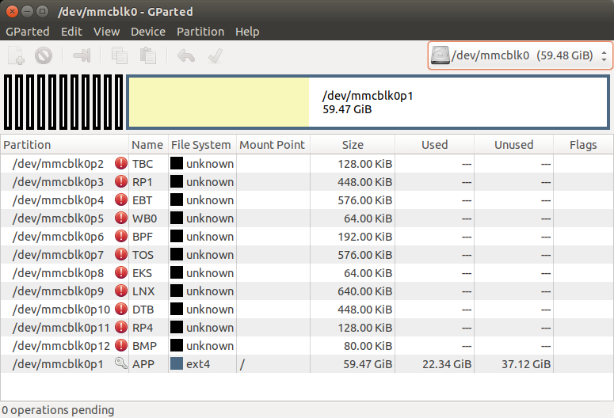
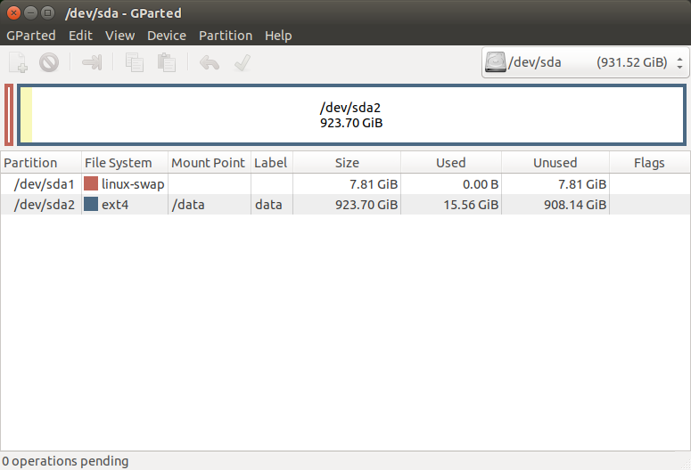
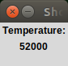

#  NVIDIA Jetson Nano

The Nvidia Jetson [Nano](https://developer.nvidia.com/embedded/jetson-nano-developer-kit) - a powerful alternative to the likes of
RPi/Movidius bundle when you are looking for a powerful edge device,
which can cope with some machine learning/deep learning tasks. This page
provides some details about hardware and software related topics -
stuff, which had been useful to do the first steps with the device.

## Basic Hardware Setup

The Nvidia box, which comes woith the device is pretty much useless for
serious work. Just throw it away and start the beefing up right away -
or at least prepare for it.

## 3D Printed Case

To get a nice to handle package a 3D printed case has been used. The
needed case package can be found on the
[Thingyverse](https://www.thingiverse.com/thing:3518410) site. The case,
done by Thingyverse user *ecoiras* fits snuggly and is very well done.
Only the connector side is a bit delicate and breaks easily.


Well, if you print it with a cheap printer and just one color the case looks like this:


A look into the inside:


##  Commercial Case

A commercial case has been ordered but has not yet arrived.


##  Power Supply

The Jetson Nano can run in two different **power modes**. Per default
the board is running in the "10 Watt" mode (also known as *Mode 0*) but
there is also the optional/fallback "5 Watt" mode. The 10 Watt mode has
a catch: The Jetson module itself already consumes 10 Watt when all
cores are up and running. There is no more reserve available if you are
running the board via the Micro-USB connector with 5V and 2A max. The
module does not get what it wants since the Jetson basis board and all
connected USB devices drain some power too.

During the first test runs the board was still fine (mouse, keyboard,
Webcam) and it ran also nicely even after adding the fan. Still it is
highly recommended to switch to a 5V 4A power supply with the Barrel
Jack connector (5V inside). The shown power supply (LEICKE Power Supply
5V 4A | 20W) works fine with the device - you may find others from the
usual sources.


To activate the Barrel Jack power supply a Jumper needs to be set. The
related jumper (not part of the Jetson Nano board delivery so remember
where you last saw jumpers laying around) is located next to the camera
interface:


Now everything runs inside the specs and the power hungry DL inference
can run safely.

##  Power Modes

Show current power mode:

```
sudo nvpmodel -q
```

The output migh look like this:

```
NV Power Mode: MAXN
0
```

To set mode 0 (10W):

```
sudo nvpmodel -m 0
```

To set mode 0 (10W):

```
sudo nvpmodel -m 1
```

It is possible to define your own *nvpmodel* - the respective
configuration file can be found here:

```
nano /etc/nvpmodel/nvpmodel_t210_jetson-nano.conf
```

The configuration allows one to change clock rates and many other
details (to be covered later). But the **Power_Model Definitions**
sections is revealing:


```
###########################
#                         #
# POWER_MODEL DEFINITIONS #
#                         #
###########################

# MAXN is the NONE power model to release all constraints
< POWER_MODEL ID=0 NAME=MAXN >
CPU_ONLINE CORE_0 1
CPU_ONLINE CORE_1 1
CPU_ONLINE CORE_2 1
CPU_ONLINE CORE_3 1
CPU_A57 MIN_FREQ  0
CPU_A57 MAX_FREQ -1
GPU_POWER_CONTROL_ENABLE GPU_PWR_CNTL_EN on
GPU MIN_FREQ  0
GPU MAX_FREQ -1
GPU_POWER_CONTROL_DISABLE GPU_PWR_CNTL_DIS auto
EMC MAX_FREQ 0

< POWER_MODEL ID=1 NAME=5W >
CPU_ONLINE CORE_0 1
CPU_ONLINE CORE_1 1
CPU_ONLINE CORE_2 0
CPU_ONLINE CORE_3 0
CPU_A57 MIN_FREQ  0
CPU_A57 MAX_FREQ 918000
GPU_POWER_CONTROL_ENABLE GPU_PWR_CNTL_EN on
GPU MIN_FREQ 0
GPU MAX_FREQ 640000000
GPU_POWER_CONTROL_DISABLE GPU_PWR_CNTL_DIS auto
EMC MAX_FREQ 1600000000
```

As can be seen the power consumption is controlled in a very easy
manner: Mode 1 is just using half of the available CPU cores
running at reduced speed. Thus, if you want to use all of the available
oooomph from the Nano, always run it in Mode 0 and power the board
accordingly with the Barrel Jack connector and a decent 4A supply.

The configuration defines some more parameters including the minimum and
maximum frequencies per core. These settings are needed to describe the
**Dynamic Voltage and Frequency Scaling** (DVFS) behavior. DVFS is a
mechanism to dynamically crank up the CPU depending on the current
system load.

A call to

```
sudo jetson_clocks --show
```

reveals the current settings:

```
SOC family:tegra210  Machine:jetson-nano
Online CPUs: 0-3
CPU Cluster Switching: Disabled
cpu0: Online=1 Governor=schedutil MinFreq=102000 MaxFreq=1428000 CurrentFreq=1428000 IdleStates: WFI=1 c7=1
cpu1: Online=1 Governor=schedutil MinFreq=102000 MaxFreq=1428000 CurrentFreq=1428000 IdleStates: WFI=1 c7=1
cpu2: Online=1 Governor=schedutil MinFreq=102000 MaxFreq=1428000 CurrentFreq=1428000 IdleStates: WFI=1 c7=1
cpu3: Online=1 Governor=schedutil MinFreq=102000 MaxFreq=1428000 CurrentFreq=1428000 IdleStates: WFI=1 c7=1
GPU MinFreq=76800000 MaxFreq=921600000 CurrentFreq=153600000
EMC MinFreq=204000000 MaxFreq=1600000000 CurrentFreq=1600000000 FreqOverride=0
Fan: speed=0
NV Power Mode: MAXN
```

Now use the next command to save the current values into a .conf file:

```
sudo jetson_clocks --store oldClocks.conf
```

The content shows how the initial configuration from
```/etc/nvpmodel/nvpmodel_t210_jetson-nano.conf``` turns into the
related system device settings:


```
/sys/devices/system/cpu/cpu0/online:1
/sys/devices/system/cpu/cpu1/online:1
/sys/devices/system/cpu/cpu2/online:1
/sys/devices/system/cpu/cpu3/online:1
/sys/devices/system/cpu/cpu0/cpufreq/scaling_min_freq:102000
/sys/devices/system/cpu/cpu1/cpufreq/scaling_min_freq:102000
/sys/devices/system/cpu/cpu2/cpufreq/scaling_min_freq:102000
/sys/devices/system/cpu/cpu3/cpufreq/scaling_min_freq:102000
/sys/devices/system/cpu/cpu0/cpuidle/state0/disable:0
/sys/devices/system/cpu/cpu0/cpuidle/state1/disable:0
/sys/devices/system/cpu/cpu1/cpuidle/state0/disable:0
/sys/devices/system/cpu/cpu1/cpuidle/state1/disable:0
/sys/devices/system/cpu/cpu2/cpuidle/state0/disable:0
/sys/devices/system/cpu/cpu2/cpuidle/state1/disable:0
/sys/devices/system/cpu/cpu3/cpuidle/state0/disable:0
/sys/devices/system/cpu/cpu3/cpuidle/state1/disable:0
/sys/devices/57000000.gpu/devfreq/57000000.gpu/min_freq:76800000
/sys/devices/57000000.gpu/railgate_enable:1
/sys/kernel/debug/clk/override.emc/clk_state:0
/sys/devices/pwm-fan/target_pwm:0
/sys/devices/pwm-fan/temp_control:1
```

**Note**: When idling, the temperature reaches about 50 degrees Celsius
when the Nano based on the default settings. Your mileage may vary
depending on the current environmental temperature. It may be a good
idea to watch the temp when playing around. The needed script/info about
temperatures can be found in the "Useful Scripts" chapter.

Now it is save to activate the maximum values right away to check it
out:

```
sudo jetson_clocks
```

The updated configuration file looks like this:

```
/sys/devices/system/cpu/cpu0/online:1
/sys/devices/system/cpu/cpu1/online:1
/sys/devices/system/cpu/cpu2/online:1
/sys/devices/system/cpu/cpu3/online:1
/sys/devices/system/cpu/cpu0/cpufreq/scaling_min_freq:1428000
/sys/devices/system/cpu/cpu1/cpufreq/scaling_min_freq:1428000
/sys/devices/system/cpu/cpu2/cpufreq/scaling_min_freq:1428000
/sys/devices/system/cpu/cpu3/cpufreq/scaling_min_freq:1428000
/sys/devices/system/cpu/cpu0/cpuidle/state0/disable:1
/sys/devices/system/cpu/cpu0/cpuidle/state1/disable:1
/sys/devices/system/cpu/cpu1/cpuidle/state0/disable:1
/sys/devices/system/cpu/cpu1/cpuidle/state1/disable:1
/sys/devices/system/cpu/cpu2/cpuidle/state0/disable:1
/sys/devices/system/cpu/cpu2/cpuidle/state1/disable:1
/sys/devices/system/cpu/cpu3/cpuidle/state0/disable:1
/sys/devices/system/cpu/cpu3/cpuidle/state1/disable:1
/sys/devices/57000000.gpu/devfreq/57000000.gpu/min_freq:921600000
/sys/devices/57000000.gpu/railgate_enable:0
/sys/kernel/debug/clk/override.emc/clk_state:1
/sys/devices/pwm-fan/target_pwm:255
/sys/devices/pwm-fan/temp_control:0
```

After calling the mighty *jetson_clocks* the system runs at full speed
including the fan (if connected). As a result the temperature drops to
36 degrees when idling.

To switch back to the default settings:

```
sudo jetson_clocks --restore oldClocks.conf
```


# Hardware Extensions

##  Fan

When running the first real inference tasks the CPU temperature easily
jumped over 60 degrees and it seemed to have an negative impact on
system stability as the nano occasionally went into freezing mode from
time to time. The first hardware option added has been the fan. As
recommended by others in forums etc. the "Noctua NF-A4x20 5V PWM" has
been chosen. This fan is a bit on the expensive side, but very well
built and very silent. The fan comes with a lot of additional material,
which is of no use in this environment. To fix the fan two slim zip ties
have been used.


The fan control is based on the current temperature but it is also
possible to activate or de-activate the fan via a command.

Activating the fan:

```
sudo sh -c 'echo 255 > /sys/devices/pwm-fan/target_pwm' 
```

De-Activating the Fan:

```
sudo sh -c 'echo 0 > /sys/devices/pwm-fan/target_pwm'
```

Since the fan activation on the board is temperature controlled there is
usually no need to explicitly activate/deactivate it though.

##  SSD Hard Drive

The SD card is the primary non-volatile memory system for the Nano. The
SD card stores the complete operating system, all data models (if
needed) and of cause all applications and the respective code you may
run. Thus it is always a good idea to use a 64 GByte SD card, which
will give you enough head room for everything.

But if you need additional memory for even more training/inference data,
faster general data access or if you want to add some decent swap space
an external SSD is of great use. For the work to be done a SanDisk 1 TB
SSD (SanDisk SSD PLUS 1TB Sata III 2,5 Inch internal-SSD, 535MB/Sek) has
been chosen. Check out the options - the price of this device was moving
between 88 and 140+ E>uros in one week.

To be able to connect it to the USB 3.0 slot a adapter is needed (CSL -
USB 3.0 SSD SATA Adapter or comparable):


To manage the file system you can either use the already installed
*parted* command or use the more intuitive graphical UI for *parted*.
This UI comes with the *gparted* application. To install the *gparted*
application use the next command:

```
sudo apt-get install gparted
```

With just the initial SD card inserted the information may look like
this:




Now its time to define the partition info for the SSD. First a partition
table (MSDOS) has to be set for the complete device. Then its up to you
to define the partition details.

## Adding swap

In the following example 8 GByte have been dedicated as *linux swap* and
the reminder of the available 1 TB are mapped to the */mnt/data* folder.
This folder needs to be present in the root file system to allow for a
later file system *mount*. Check the chosen settings and select the green
arrow on the *gparted* main menu. This will start the partitioning - all
current data on the SSD will be gone after this step.



Now its time to define the mapping for two new partitions by editing the
fstab file:

```
sudo nano /etc/fstab
```

Change the *fstab* file along the lines of this example:

```
/dev/root      /           ext4  defaults 0 1
/dev/sda1      swap        swap  defaults 0 0
/dev/sda2      /mnt/data   ext4  defaults 0 2
```

Now you can already activate the swap with this command:

```
sudo swapon -a
```

A quick check in the system monitor will reveal the new swap swap being
available.


During the next boot the */mn/data* mount point is mounted with the
respective SSD partition - in our case */dev/sda2*.


**Note**: It is currently not possible to boot from SSD directly.

**Note**: It is **not** recommended to use the SD card as swap space.
While possible you would wear out the memory region defined by the
static *swap* file (something like "*/mnt/swapfile*") pretty fast.


# Software


##  Useful Scripts


##  Temperature Control

The current state of important temperature values can be retrieved via
this command:

```
cat /sys/devices/virtual/thermal/thermal_zone*/temp
```

Result:

```
50000
41500
40500
40500
100000
41250
```

The explanation of the given distinct values are explained via this
command:

```
cat /sys/devices/virtual/thermal/thermal_zone*/type
```

A good general ressource is the Jetson/Thermal
[blog](https://elinux.org/Jetson/Thermal) from elinux.org. This blog 
provides also the code for a simple "showTemp.pl" Perl script, which
will show the current temperature. Can come in very handy when running
intense use cases.




##  System Stats

The following command displays some important system parameters like
various temperature values, CPU core loads or currently available
memory:

```
sudo tegrastats
```


##  Boot Phase


While the file */etc/rc.local* has gone with Ubuntu 18.04 it is still
possible to add this file manually. If present the contents will be read
and used as the last step of the system boot phase.
          
```
$ cat /etc/rc.local
#!/bin/bash
sleep 10
sudo /usr/bin/jetson_clocks
sudo sh -c 'echo 255 > /sys/devices/pwm-fan/target_pwm'
```


The following chapters will be covered soon.

Machine/Deep Learning


Operating System


Demos/Examples


Forums/Youtube


# Shopping List

If you want to buy some of the products covered, i have listed the links
below.

###  Amazon Germany

<a target="_blank" href="https://www.amazon.de/gp/product/B01HRR9GY4/ref=as_li_tl?ie=UTF8&camp=1638&creative=6742&creativeASIN=B01HRR9GY4&linkCode=as2&tag=jfey60-21&linkId=110cc676838e4888f3a9e0bee845e3fe">LEICKE Netzteil 5V 4A | Ladegerät 20W für Externe DVD/Blu Ray Laufwerke - Festplatten | Akku, Ladestationen, Smart-Geräte, Radiowecker</a>

<a target="_blank" href="https://www.amazon.de/gp/product/B07D998212/ref=as_li_tl?ie=UTF8&camp=1638&creative=6742&creativeASIN=B07D998212&linkCode=as2&tag=jfey60-21&linkId=fd9a40cb0bbd4ffe10fd00a5cd6a69ca">SanDisk SSD PLUS 1TB Sata III 2,5 Zoll Interne-SSD, bis zu 535MB/Sek</a>

<a target="_blank" href="https://www.amazon.de/gp/product/B01K22TZ3I/ref=as_li_tl?ie=UTF8&camp=1638&creative=6742&creativeASIN=B01K22TZ3I&linkCode=as2&tag=jfey60-21&linkId=5703bf8e4ea276398c470db387afed59">CSL - USB 3.0 SSD SATA Adapter - Konverter | für SSD SATA 1 2 3 2,5“ 6,35cm HDD 3,5“ 8,89cm Laufwerke | inkl. Netzteil</a>

<a target="_blank" href="https://www.amazon.de/gp/product/B071FNHVXN/ref=as_li_tl?ie=UTF8&camp=1638&creative=6742&creativeASIN=B071FNHVXN&linkCode=as2&tag=jfey60-21&linkId=72cc0e23dc359ece375c9ebffbbf2042">Noctua NF-A4x20 5V PWM, Leiser Premium-Lüfter, 4-Pin, 5V Version (40x20mm Braun)</a>

### Amazon USA

<a target="_blank" href="https://www.amazon.com/gp/product/B07D998212/ref=as_li_tl?ie=UTF8&camp=1789&creative=9325&creativeASIN=B07D998212&linkCode=as2&tag=jfey60-20&linkId=5cde052de09fc32029525bf70a1e9ca7">SanDisk SSD PLUS 1TB Internal SSD - SATA III 6 Gb/s, 2.5"/7mm - SDSSDA-1T00-G26</a>

<a target="_blank" href="https://www.amazon.com/gp/product/B011M8YACM/ref=as_li_tl?ie=UTF8&camp=1789&creative=9325&creativeASIN=B011M8YACM&linkCode=as2&tag=jfey60-20&linkId=5a6a214c3d69c4e7e00ee6f4e4eddf3a">Sabrent USB 3.0 to SSD / 2.5-Inch SATA Hard Drive Adapter [Optimized for SSD, Support UASP SATA III] (EC-SSHD)</a>

<a target="_blank" href="https://www.amazon.com/gp/product/B071W93333/ref=as_li_tl?ie=UTF8&camp=1789&creative=9325&creativeASIN=B071W93333&linkCode=as2&tag=jfey60-20&linkId=61385cc07308d2fb538b4bae1f13fcd9">Noctua NF-A4x20 PWM, Premium Quiet Fan, 4-Pin (40x20mm, Brown)</a>

