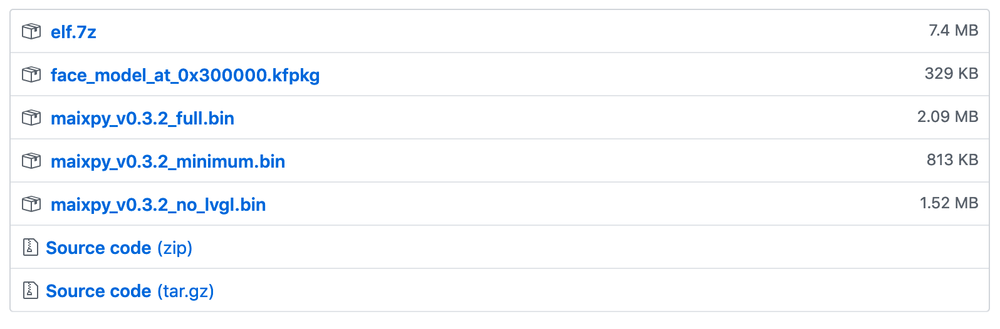

# MAIX GO

The MAIX Go started as a IndieGogo [project](https://www.indiegogo.com/projects/sipeed-maix-the-world-first-risc-v-64-ai-module#/) and is a complete IoT/ML/DL environment for embedded use cases. The list of features is impressive:

- KPU [K210](http://dl.sipeed.com/MAIX/SDK/Document/kendryte_datasheet_20181011163248_en.pdf) : Dual Core 64-Bit RISC-V CPU/FPU, 400 Mhz Neural Network
- Processor on chip 8 MB SRAM Audio Processor Programmable FPIOA DVP
- Camera
- LCD
- Display
- WLAN
- Various HW accelerators: SHA256, AES, FFT
- Plenty of I/O
- USB-C connector for power and programming
- Micropython
- Supports Tensorflow Lite, MobileNet V1 and Tiny-Yolo


The "Sipeed MAIX Go Suit" product, which is covered here is a complete system with camera, display, speaker, a lithium battery, a small WLAN antenna and a simple case - all for around 40 US Dollar (plus import taxes if applicable).


The official [datasheet](http://dl.sipeed.com/MAIX/HDK/Maix-GO/Specifications/Sipeed%20MaixGo%20Datasheet%20V1.1.pdf) summarizes the features. GitJer has also compiled some information on [github](https://github.com/GitJer/Some-Sipeed-MAIX-GO-k210-stuff).


(Source: IndieGogo page)

# Software Installation

The MAIX GO supports various software environments like [FreeRTOS](http://dl.sipeed.com/MAIX/SDK/Document/kendryte_freertos_programming_guide_en.pdf), the [K210 standalone SDK](http://dl.sipeed.com/MAIX/SDK/ToolChain/) (Standard Development Kit)
and Micropython. We are focusing on the Micropython part called [Maix](https://maixpy.sipeed.com/en/) Py here. Sipeed, the force behind
the MAIX Go and many other boards, is providing lots of [example projects](https://github.com/sipeed/MaixPy_scripts) on their github site.

Examples for the SDK can be found in this [repo](https://github.com/sipeed/LicheeDan_K210_examples) .

**Note**: The complete github repo from sipeed can be found [here](https://github.com/sipeed).


## Firmware Upgrade

Upgrading the firmware is a recommended step while setting up the GO for the first time for any project. The GO, which had been delivered some weeks ago, was running an older version of the firmware, which did not yet support the current IDE. This alone is a good reason to update. The firmware is based on [open-ec](https://github.com/sipeed/open-ec). The necessary steps are covered in this official [document](https://maixpy.sipeed.com/en/get_started/upgrade_firmware.html).
These were the steps to upgrade successfully on OSX:

1.) Connect the board with an USB_C cable to the Mac and switch on the device. After a while the GO should be showing the boot screen with the "Welcome to the MaixPy" message. A check in */dev* should show two additional TTY devices:

```
crw-rw-rw-  1 root  wheel   18,  36 27 Jul 14:50 tty.usbserial-00001014A
crw-rw-rw-  1 root  wheel   18,  38 27 Jul 14:50 tty.usbserial-00001014B
```

To flash the firmware either use the [kflash.py](https://github.com/kendryte/kflash.py) tool or the nice GUI Wrapper [kflash_gui](https://github.com/sipeed/kflash_gui/releases) application. The current firmware can be found [here](https://github.com/sipeed/MaixPy/releases) and the ready-to-go builds are available [here](http://dl.sipeed.com/MAIX/MaixPy/release/master/) .

Usually each firmware version comes with a set of different setups. From the official documentation regarding the firmware naming conventions:

```
    maixpy_v*_no_lvgl.bin： MaixPy firmware, without LVGL version. (LVGL is an embedded GUI framework, you need to use when writing the interface)
    maixpy_v*_full.bin： Full version of MaixPy firmware (MicroPython + OpenMV API + lvgl)
    maixpy_v0.3.1_minimum.bin： MaixPy firmware minimum set, not supported ´by MaixPy IDE, does not contain OpenMVrelated algorithms
    face_model_at_0x300000.kfpkg： Face model, placed in address 0x300000, can be downloaded multiple times without conflict
    elf.7z： elf file, ordinary users do not care, used for crash debugging
```

Typical list of files for a given build. The latest version may be available as source only.



After downloading the latest firmware (V0.4.0_9 at the time of writing) start the firmware update with the following command (the option **-B goE** is needed for the GO):

```
 ./kflash.py -B goE maixpy_v0.4.0_9_g598f743.bin -p /dev/tty.usbserial-00001014B`   `
```

The process starts and shows information like this:

```
[INFO] COM Port Selected Manually:  /dev/tty.usbserial-00001014B
[INFO] Default baudrate is 115200 , later it may be changed to the value you set.
[INFO] Trying to Enter the ISP Mode...
*
[INFO] Greeting Message Detected, Start Downloading ISP
Downloading ISP: |=========================================================================...====================| 100.0% 10kiB/s
[INFO] Booting From 0x80000000
[INFO] Wait For 0.1 second for ISP to Boot
[INFO] Boot to Flashmode Successfully
[INFO] Selected Flash:  On-Board
[INFO] Initialization flash Successfully
Programming BIN: |=========================================================================...====================| 100.0% 10kiB/s
[INFO] Rebooting...     `
```

**Note**: The GUI version did not start on my MBP and thus the command line script had been used.


## MyPy

To run Python code on the Go you can use the REPL interface, which is running on the board. In the first step a serial connection to the GO must be established:

A tool like **screen** or **minicom** can be used on OSX or Linux. For Windows systems **putty** is a good choice.

```
brew install minicom
```

```
sudo apt update
sudo apt install screen
sudo screen /dev/tty.usbserial-00001014B 115200
```

The device will come back with this initial screen - the *>>>* is the Micropython **REPL** (Read Eval Print Loop) prompt:

```
[MAXPY]Pll0:freq:832000000
[MAIXPY]Pll1:freq:398666666
[MAIXPY]Pll2:freq:45066666
[MAIXPY]cpu:freq:416000000
[MAIXPY]kpu:freq:398666666
[MAIXPY]Flash:0xc8:0x17
open second core...
gc heap=0x8016d4e0-0x801ed4e0
[MaixPy] init end

 __  __
>>>


```

Start with the *help()* command:

```
>>> help()
Welcome to MicroPython on the Sipeed Maix!

For generic online docs please visit https://maixpy.sipeed.com

Official website : http://www.sipeed.com


Control commands:
  CTRL-A        -- on a blank line, enter raw REPL mode
  CTRL-B        -- on a blank line, enter normal REPL mode
  CTRL-C        -- interrupt a running program
  CTRL-D        -- on a blank line, do a soft reset of the board
  CTRL-E        -- on a blank line, enter paste mode

For further help on a specific object, type help(obj)
For a list of available modules, type help('modules')
>>> help()


```

After pressing the "reset" button on the GO this message is shown:

```
[MAIXPY]Pll0:freq:832000000
[MAIXPY]Pll1:freq:398666666
[MAIXPY]Pll2:freq:45066666
[MAIXPY]cpu:freq:416000000
[MAIXPY]kpu:freq:398666666
[MAIXPY]Flash:0xc8:0x17
open second core...
gc heap=0x8016d4e0-0x801ed4e0
[MaixPy] init end

 __  __              _____  __   __  _____   __     __
|  \/  |     /\     |_   _| \ \ / / |  __ \  \ \   / /
| \  / |    /  \      | |    \ V /  | |__) |  \ \_/ /
| |\/| |   / /\ \     | |     > <   |  ___/    \   /
| |  | |  / ____ \   _| |_   / . \  | |         | |
|_|  |_| /_/    \_\ |_____| /_/ \_\ |_|         |_|

Official Site : https://www.sipeed.com
Wiki          : https://maixpy.sipeed.com

MicroPython v0.4.0-9-g598f743 on 2019-07-20; Sipeed_M1 with kendryte-k210
Type "help()" for more information.
>>>


```

Its possible to run small programs directly from the **REPL**, but a real IDE is far better suited.

## Running Custom Python Applications

If the Go firmware finds a SD card attached (FAT not FAT32) it will look for the file **boot.py** as part of the Micropython startup. Usually the **boot.py** will setup the environment and **main.py** will be the application, which will be called from **boot.py**.

### The pye Editor

The Micropython release comes with "pye" - a [simple](https://github.com/robert-hh/Micropython-Editor) Python editor (expecting a VT100 compatible terminal). To start the editor use the following command from the REPL:

```
from pye_mp import pye
pye("/sd/boot.py")
```
The editor is using the serial interface and thus is a bit on the slow side. The IDE is a better choice for serious programming. Other ways to upload programs are documented [here](https://maixpy.sipeed.com/en/get_started/upload_script.html).


### The MaixPy IDE

The main programming environment for the GO is the MaixPy IDE, which is available for download [here](http://dl.sipeed.com/MAIX/MaixPy/ide/v0.2.3/). After setting up the connection to the second tty.usb channel the default demo app can be transferred onto the device and run by pressing the green arrow in the bottom left area of the IDE.
The application will start immediately and the IDE shows the camera stream and the related RGB values. Obviously the streaming over serial reduces the fps - the comment in the demo code explains that the fps rate is cut to half when connected to the IDE.


 Now its time to check out some of the example [scripts](https://github.com/sipeed/MaixPy_scripts) from sipeed. The examples explain how to use all of the hardware components and thus provides a good foundation to explore the capabilities of using Micropython on the GO.
 

## MaixPi Components

The software support for the given hardware features is very rich. This chapter shows some examples.

### kpu

The following test program is provided to run a tiny Yolo model on the device:

```
import sensor
import image
import lcd
import KPU as kpu

lcd.init()
sensor.reset()
sensor.set_pixformat(sensor.RGB565)
sensor.set_framesize(sensor.QVGA)
sensor.run(1)
task = kpu.load(0x300000) #使用kfpkg将 kmodel 与 maixpy 固件打包下载到 flash
#task = kpu.load('/sd/face_model_at_0x300000.kfpkg')
anchor = (1.889, 2.5245, 2.9465, 3.94056, 3.99987, 5.3658, 5.155437, 6.92275, 6.718375, 9.01025)
a = kpu.init_yolo2(task, 0.5, 0.3, 5, anchor)
while(True):
    img = sensor.snapshot()
    code = kpu.run_yolo2(task, img)
    if code:
        for i in code:
            print(i)
            a = img.draw_rectangle(i.rect())
    a = lcd.display(img)
a = kpu.deinit(task)
```

To flash the model use the following command (note, that the name of the USB tty device changed between reboots, usage):

```
~/P/H/firmware ❯❯❯ python3 kflash.py -p /dev/tty.usbserial-00002014B -b 3000000 -B goE face_model_at_0x300000.kfpkg
```

The result:

```
[INFO] COM Port Selected Manually:  /dev/tty.usbserial-00002014B
[INFO] Default baudrate is 115200 , later it may be changed to the value you set.
[INFO] Trying to Enter the ISP Mode...
*
[INFO] Greeting Message Detected, Start Downloading ISP
[INFO] Selected Stage0 Baudrate:  1500000
[INFO] FT2232 mode
Downloading ISP: |=================================================================================================================================================================================================================| 100.0%
[INFO] Booting From 0x80000000
[INFO] Wait For 0.1 second for ISP to Boot
[WARN] Timeout Error, retrying...
[INFO] Boot to Flashmode Successfully
[INFO] Selected Baudrate:  3000000
[INFO] Baudrate changed, greeting with ISP again ...
[INFO] Boot to Flashmode Successfully
[INFO] Selected Flash:  On-Board
[INFO] Initialization flash Successfully
[INFO] Extracting KFPKG ...
[INFO] Writing facedetect.kmodel into 0x00300000
Programming BIN: |=================================================================================================================================================================================================================| 100.0% 80kiB/s
[INFO] Rebooting...

```

Now the yolo model is saved on flash and thus the following code line will work:

```
task = kpu.load(0x300000)
```

After the program starts if will draw a box around detected faces as the next screenshot shows:


A good tutorial explaining how to train a MobileNet Transfer Learning image classifier model, convert it to Tensorflow Lite  and then to kmodel can be seen in gheesungs [blog](https://iotdiary.blogspot.com/2019/07/maixpy-go-mobilenet-transfer-learning.html) article.  The related Jupyther notebook can be found [here](https://gist.github.com/gheesung/eb0076e040ba53d5be2ad2db1c70cf82#file-image-classification-with-sipeed-maix-using-mobilenetv1-ipynb). The result can be seen in [this](https://www.youtube.com/watch?v=0Pc0LwmRWRk) YouTube video.

Another nice run through the topic can be found in the blog post

As some examples show one has to remove components in the firmware to make room for larger models. Some hints [here](https://bbs.sipeed.com/t/topic/683) .


### Converting keras h5 to kmodel

```
#!/bin/bash
echo "Usage: ./convert.sh keras_modelxxx.h5"
name=`echo $1 | cut -d '.' -f 1`
tflite_out=$name.tflite
kmodel_out=$name.kmodel

#Adjust this
ncc_exe=../../../tools/nncase/ncc
tflite_convert_exe=tflite_convert

echo ">> Converting H5 to TFlite"
$tflite_convert_exe --keras_model_file $1 --output_file $tflite_out

echo ">> Converting TFlite to Kmodel"
$ncc_exe -i tflite -o k210model --dataset dataset-all $tflite_out ./$kmodel_out

echo ">> OK. Not if all goes well, copy $kmodel_out to scr folder"
```
Source( [github](https://github.com/andriyadi/Maix-LogoClassifier/blob/master/training/convert.sh) )

# Build your own Firmware Package


A nice blog article explaining how to build a bootable firmware including your application can be found in this sipeed blog [article](http://blog.sipeed.com/p/390.html). Basically is is about building the needded kfpkg file. A **kfpkg** file can consist of multiple bin files, a deep learning model, some other content assets and the Micropython program code.

When definning a specific target address like *0x2000000* or *0x3000000* (as shown in most examples) the kpu module is able to directly access the model.


## OpenMV Machine Vision

The [OpenMV](https://docs.openmv.io/index.html) package is a Micropython powered Machine Vision library. A good blog post can be found on [Instructables](https://www.instructables.com/id/Sipeed-MaiX-Bit-OpenMV-Demos-Computer-Vision/) .
Github [repo](https://github.com/openmv/openmv/tree/master/scripts/examples) using OpenMV.

Also of interest might be an [article](https://community.arm.com/innovation/b/blog/posts/low-power-deep-learning-on-openmv-cam) of the OpenMV inventor Ibrahim Abdalkader covering training a model based on the "smile" dataset.


Person [Detector](https://www.youtube.com/watch?time_continue=10&v=_mfiRDdKHd8) using FLIR Lepton. Code and Model [here](http://forums.openmv.io/viewtopic.php?f=6&t=1321). This code is for a [FLIR](https://www.youtube.com/watch?v=7Q8A6LeP41g) Thermal camera but it might be not that complex to adapt to the MAIX GO:


